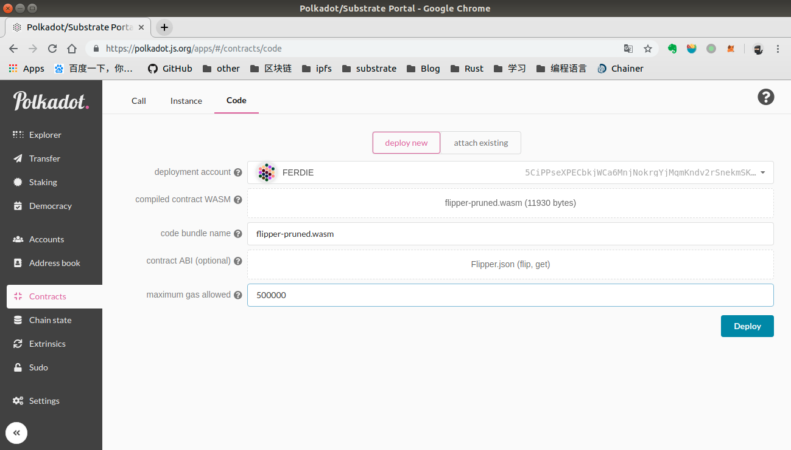

# Wasm-ERC20

This guide will cover the basics of smart contract development on Substrate using ink!, and show you how you can use Substrate and the contract module to deploy and interact with your smart contract.The file src/lib.rs is an example of implementing ERC20.

Table of Contents
=================

   * [Prerequisites](#prerequisites)
      * [Substrate](#substrate)
      * [Wasm Build Environment](#wasm-build-environment)
      * [ink! CLI](#ink-cli)
   * [Writing Your First Smart Contract](#writing-your-first-smart-contract)
      * [Creating an ink! Project](#creating-an-ink-project)
      * [Skeleton of a Smart Contract](#skeleton-of-a-smart-contract)
      * [Contract Storage](#contract-storage)
      * [Contract Deployment](#contract-deployment)
      * [MUST Initialize Value State](#must-initialize-value-state)
      * [Deployment Variables](#deployment-variables)
      * [Contract Caller](#contract-caller)
      * [Contract Functions](#contract-functions)
      * [Public and Private Functions](#public-and-private-functions)
      * [Mutable and Immutable Functions](#mutable-and-immutable-functions)
   * [Testing Your Contract](#testing-your-contract)
   * [Building Your Contract](#building-your-contract)
      * [Contract ABI](#contract-abi)
   * [Running a Substrate Node](#running-a-substrate-node)
   * [Deploying Your Contract](#deploying-your-contract)
      * [Putting Your Code on the Blockchain](#putting-your-code-on-the-blockchain)
      * [Calling Your Contract](#calling-your-contract)
         * [get()](#get)
         * [flip()](#flip)

# Prerequisites

At first, you will need to set up some stuff on your computer.

## Substrate

To get started, you need to make sure your computer is set up to build and run Substrate.

If you are using OSX or most popular Linux distros, you can do that with a simple one-liner:

```bash
curl https://getsubstrate.io -sSf | bash
```

In addition to installing prerequisite libraries, this command will also install the `substrate`command to your path so that you can start a substrate node easily.

If you are using another operating system, like Windows, follow the installation instructions on the [Substrate readme](https://github.com/paritytech/substrate#61-hacking-on-substrate).

## Wasm Build Environment

Next you need to set up the Wasm build environment within Rust. While ink! is pinned to a specific nightly version of the Rust compiler you will need to explicitly install that toolchain:

```bash
rustup install nightly-2019-04-20
rustup default nightly-2019-04-20
rustup target add wasm32-unknown-unknown --toolchain nightly-2019-04-20
```

Wasm Utilities

* [Binaryen](https://github.com/WebAssembly/binaryen)
* [Wabt](https://github.com/WebAssembly/wabt)
* [Parity wasm-utils](https://github.com/paritytech/wasm-utils)

In order to prepare Binaryen and Wabt, the best way is to compile from source code. Remember to add them to your path!

As for Parity wasm-utils, you can do that with a simple one-liner:

```
cargo install pwasm-utils-cli --bin wasm-prune
```

We will be using `wasm2wat` (wabt), `wat2wasm` (wabt), `wasm-opt` (binaryen), and `wasm-prune` (wasm-utils) later in the guide.

## ink! CLI

You can install the utility using Cargo with:

```bash
cargo install --force --git https://github.com/paritytech/ink cargo-contract
```

You can then use `cargo contract --help` to start exploring the commands made available to you.

> **Note**: The ink! CLI is under heavy development and many of its commands are not implemented, yet!

# Writing Your First Smart Contract

## Creating an ink! Project

```bash
cargo contract new contract_name
```

This command will create a new project folder named `flipper` which we will explore:

```
flipper
|
+-- .cargo
|   |
|   +-- config      <-- Compiler Configuration (Safe Math Flag)
|
+-- src
|   |
|   +-- lib.rs      <-- Contract Source Code
|
+-- build.sh        <-- Wasm Build Script
|
+-- rust-toolchain
|
+-- Cargo.toml
|
+-- .gitignoreCopy
```

The ink CLI automatically generates the source code for the "Flipper" contract, which is about the simplest "smart" contract you can build.

## Skeleton of a Smart Contract

Let's take a look at a high level what is available to you when developing a smart contract using the ink!:

```rust
#![no_std]

// Import to interact with contract storage
use ink_core::storage;
// Import the `contract!` macro
use ink_lang::contract;

// The code for your contract will live entirely in the `contract!` macro
contract! {
    struct ContractName {
        // Contract Storage
    }

    impl Deploy for ContractName {
        fn deploy(&mut self) {
            // Deployment logic that runs once upon contract creation
        }
    }

    impl ContractName {
        // Public/Private Function Definitions
    }
}
```

Let's walk through each part of the contract structure.

## Contract Storage

The entire ink! smart contract is built off of a `struct` which defines your contract storage.

Here is how you would store some simple values in storage:

```rust
contract! {
    struct MyContract {
        // Store a bool
        my_bool: storage::Value<bool>,
        // Store some number
        my_number: storage::Value<u32>,
    }
    ...
}
```

Contract storage like `storage::Value<T>` is allowed to be generic over types that are encodable and decodable which includes the most common types such as `bool`, `u{8,16,32,64,128}` and `i{8,16,32,64,128}`, `AccountId`, `Balance` as well as tuples and arrays.

```rust
// Note that you will need to import `AccountId` and/or `Balance` to use them
use ink_core::env::{AccountId, Balance};

contract! {
    struct MyContract {
        // Store some AccountId
        my_address: storage::Value<AccountId>,
        // Store some Balance
        my_balance: storage::Value<Balance>,
    }
    ...
}
```

You can also store some more complex values like `String` or a mapping:

```rust
use ink_core::env::{AccountId, Balance};
// Note that you will need to import the `String` type to use it
use ink_core::memory::string::String;

contract! {
    struct MyContract {
        // Store a string
        my_string: storage::Value<String>,
        // Store a key/value map; AccountId -> Balance
        my_map: storage::HashMap<AccountId, Balance>,
    }
    ...
}
```

## Contract Deployment

Every ink! smart contract must implement the `Deploy` trait which consists of a single function, `deploy`, which is run once when a contract is created.

```rust
contract! {
    struct MyContract {
        ...
    }

    impl Deploy for MyContract {
        fn deploy(&mut self) {
            // Deployment logic that runs once upon contract creation
        }
    }
}
```

> **Note:** If you are familiar with Solidity, this is similar to the `constructor`function, however in ink!, `deploy` is not optional.

> **Note:** `deploy` can take an arbitrary number of parameters. If you wish to deploy a contract using multiple parameters you can do that like this:

```rust
contract! {
    struct MyContract {
        ...
    }

    impl Deploy for MyContract {
        fn deploy(&mut self, a: bool, b: i32) {
            // Deployment logic that runs once upon contract creation using `a` and `b`
        }
    }
}
```

> **Note:** Parameter types of `deploy` and other contract messages are very restricted. We currently only allow users to pass primitives such as `bool`, `u{8,16,32,64,128}`, `i{8,16,32,64,128}` as well as SRML primitives such as `AccountId` and `Balance`.

## MUST Initialize Value State

In order to correctly access and interact with `Value` in your storage, your `deploy` function must initialize the state of each `storage::Value` item you declared.

**IMPORTANT: If you do not initialize your storage::Value items before using them, your contract will panic!**

```rust
contract! {
    struct MyContract {
        // Store a bool
        my_bool: storage::Value<bool>,
        // Store a key/value map
        my_map: storage::HashMap<AccountId, Balance>,
    }

    impl Deploy for MyContract {
        /// Initializes our state to `false` upon deploying our smart contract.
        fn deploy(&mut self) {
            self.my_bool.set(false);
        }
    }
    ...
}
```

## Deployment Variables

You can also deploy a contract with some configurable parameters so that users can customize the contract they are instantiating.

```rust
contract! {
    struct MyContract {
        // Store a number
        my_number: storage::Value<u32>,
    }

    impl Deploy for MyContract {
        /// Allows the user to initialize `my_number` with an input value
        fn deploy(&mut self, init_value: u32) {
            self.my_number.set(init_value);
        }
    }
    ...
}
```

## Contract Caller

When developing a smart contract, you always have access to the contract caller through an environment variable `env.caller()`. This can be used a number of different ways, such as defining a contract owner during contract deployment:

```rust
contract! {
    struct MyContract {
        // Store a number
        owner: storage::Value<AccountId>,
    }

    impl Deploy for MyContract {
        /// Allows the user to initialize `owner` with the contract caller
        fn deploy(&mut self) {
            self.owner.set(env.caller());
        }
    }
    ...
}
```

## Contract Functions

If you have made it this far, it is time to actually start writing the meat of your contract.

All of your contract functions go into an implementation of your contract's `struct`:

```rust
impl MyContract {
    // Public and Private functions can go here
}
```

## Public and Private Functions

As a stylistic choice, we recommend breaking up your implementation definitions for your private and public functions:

```rust
impl MyContract {
    // Public functions go here
    pub(external) fn my_public_function(&self) {
        ...
    } 
}

impl MyContract {
    // Private functions go here
    fn my_private_function(&self) {
        ...
    }
}
```

Note that all public functions must be prefixed with `pub(external)`, not just `pub`.

## Mutable and Immutable Functions

You may have noticed that the function templates included `self` as the first parameter of the contract functions. It is through `self` that you gain access to all your contract functions and storage items.

If you are simply reading from the contract storage, you only need to pass `&self`. But if you want to modify storage items, you will need to explicitly mark it as mutable, `&mut self`.

```rust
impl MyContract {
    // Public functions go here
    pub(external) fn my_getter(&self) -> u32{
        *self.my_number
    } 

    pub(external) fn my_setter(&mut self, some_value: u32) {
        self.my_number = some_value;
    }
}
```

# Testing Your Contract

Write a simple test which verifies the functionality of the contract. We can quickly test that this code is functioning as expected using the **off-chain test environment** that ink! provides.

In your project folder run:

```bash
cargo test --features test-env
```

# Building Your Contract

```bash
chmod +x build.sh
./build.sh
```

If all goes well, you should see a `target` folder being created with 5 relevant files corresponding to the steps in the script:

```
target
├── flipper-fixed.wat
├── flipper-opt.wasm
├── flipper-pruned.wasm
├── flipper.wasm
└── flipper.wat
```

The final, optimized `flipper-pruned.wasm` file is what we will actually deploy to our Substrate chain.

## Contract ABI

You will also notice a JSON file which is generated during the build script:

```
Flipper.json
```

This is your contract's Application Binary Interface (ABI). 

You can see that this file describes the interface that can be used to interact with your contract.

If there are any deployment variables needed when instantiating a new contract, those will be defined in the `deploy` section. All the public functions your contract exposes can be found in `messages` along with its function name, function parameters, return type, and whether the function is read-only.

There is also a `selector` which is a hash of the function name and is used to route your contract calls to the correct function.

The Polkadot UI uses this file to generate a friendly interface for deploying and interacting with your contract. 

In the next section we will configure the Polkadot UI.

# Running a Substrate Node

After successfully installing `substrate`, you can start a local development chain by running:

```bash
substrate --dev
```

> **Note:** If you have run this command in the past, you probably want to purge your chain so that you run through this tutorial with a clean slate. You can do this easily with `substrate purge-chain --dev`.

You should start to see blocks being produced by your node in your terminal.


You can interact with your node using the Polkadot UI:

<https://polkadot.js.org/apps/>

> **Note:** You will need to use Google Chrome to have this site interact with your local node. The Polkadot UI is hosted on a secure server, and your local node is not, which may cause compatibility issues on Firefox or Linux based Chromium. The other option is to [clone and run the Polkadot UI locally](https://github.com/polkadot-js/apps).

If you go into the **Explorer** tab of the UI, you should also see blocks being produced!

# Deploying Your Contract

Now that we have generated a Wasm binary from our source code, we want to deploy this contract onto our Substrate blockchain.

Smart contract deployment on Substrate is a little different than on traditional smart contract blockchains like Ethereum.

Whereas a completely new blob of smart contract source code is deployed each time you push a contract to Ethereum, Substrate opts to optimize this behavior. For example, the standard ERC20 token has been deployed to Ethereum thousands of times, sometimes only with changes to the initial configuration (through the Solidity `constructor` function). Each of these instances take up space on Ethereum equivalent to the contract source code size, even though no code was actually changed.

In Substrate, the contract deployment process is split into two halves:

1. Putting your code on the blockchain
2. Creating an instance of your contract

With this pattern, contract code like the ERC20 standard can be put on the blockchain a single time, but instantiated any number of times. No need to continually upload the same source code over and waste space on the blockchain.

## Putting Your Code on the Blockchain

With your Substrate development node running, you can go back to the [Polkadot UI](https://polkadot.js.org/apps/) where you will be able to interact with your blockchain. Remember to set the node to localhost.


Open the specially designed **Contracts** section of the UI.

In the **Code** section, select a *deployment account* with some account balance like Ferdie. In *compiled contract WASM*, select the `flipper-pruned.wasm` file we generated. For the *contract ABI*, select the JSON file. Finally, set the *maximum gas allowed* to `500,000` units.



After you press **Deploy** and a new block is formed, an extrinsic event is emitted with `contract.codeStored`. This means that you have successfully stored your WASM contract on your Substrate blockchain!

## Creating an Instance of Your Contract

Like Ethereum, smart contracts exist as an extension of the account system on the blockchain. Thus creating an instance of this contract will create a new `AccountId` which will store any balance managed by the smart contract and allow us to interact with the contract.

You will notice on the **Contracts** tab there is a new section called **Instance** where we will now create an instance of this smart contract.


The *code for this contract* is automatically set to the flipper contract you published, but you can imagine if you created multiple contracts, that you would be able to choose from a drop down of options.

To instantiate our contract we just need to give this contract account an *endowment* of 1000 and again set the *maximum gas allowed* to `500,000`units.

> **Note:** As mentioned earlier, contract creation involves creation of a new Account. As such, you must be sure to give the contract account at least the existential deposit defined by your blockchain. This is why we set the `endowment` to `1000`.

When you press **Instantiate**, you should see a flurry of events appear including the creation of a new account (`balances.NewAccount`) and the instantiation of the contract (`contract.Instantiated`):


## Calling Your Contract

Now that your contract has been fully deployed, we can start to interact with it! Flipper only has two functions, so we will show you what it’s like to play with both of them.

### `get()`

If you take a look back at our contract’s `deploy()` function, we set the initial value of the Flipper contract to `false`. Let’s check that this is the case.

In the **Call** section, set the *message to send* to `get(): bool`. Send a *value*of `1` with the *maximum gas allowed* set to `100,000`.


Contract calls cannot return a value to the outside world. So when you press **Call**, you will get a pretty unsatisfying `system.ExtrinsicSuccess` message. However, ink! provides a debugging tool to enable you to print messages to your node’s terminal.

If we take a look, we can actually see our storage value:


> **Note:** `println` is only allowed on `--dev` chains for debugging purposes. If you try to deploy a contract with `println` on a non-dev chain, it will not succeed.

While this is not a great long term solution, it works very well for debugging contracts, and is a placeholder for more mature solutions like contract events and dedicated view RPCs which are still under development.

### `flip()`

So let’s make the value turn `true` now!

The alternative *message to send* we can make with the UI is `flip()`. Again, we will send a *value* of `1` and a *maximum gas allowed* of `100,000`.

If the extrinsic was successful, we should then be able to go back to the `get()` function and see our updated storage:

